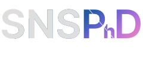

<!--  -->
<!-- ! SEE THE COMMENTED OUT INSTRUCTIONS IN THE pyproject.toml FOR UPDATE INSTRUCTIONS -->

<p align="center">
  
</p>


This is a python package of utility and styling functions used for:

<h3 style="text-align: center; color: lightblue;"><em>Optimization Techniques for Single Photon Detection and Quantum Optics</em></h3>


<h5 style="text-align: center; white-space: pre-line;">A Thesis by 
Andrew Mueller</h5>

<h5 style="text-align: center; white-space: pre-line;">In Partial Fulfillment of the Requirements for the 
Degree of Doctor of Philosophy in Applied Physics</h5>


This packages is made of 6 parts:

## viz
- Styling related functions and presets. This is used to give matplotlib and bokeh plots a custom style as seen in the thesis. 
- the `viz.save_light_dark_all()` function is used to save light-mode and dark-mode compatible figures, as well as a .pdf version of use in latex documents. It does not change color properties via rcParams, and therefore does not require changes to code before or involved with the initialization of a figure. `viz.save_light_dark_all()` just has to run at the end of a script or notebook cell, the same way `plt.savefig()` would be used. It traverses the figure DOM and modifies styling of a number of elements including lines, errorbars, legends, `imshow()` images, and other things.
<p align="center">
  
</p>

## obj
- Includes the `DataObj` class used for exporting and importing python classes as structured json files. Objects containing numpy arrays are exported using `orjson`, and re-cast into numpy arrays on import. The library follows some basic rules in order to determine what sub-objects should be converted to numpy arrays during import. Complex arrays may not import correctly. The library supports export and import of nested `DataObj` classes. When the json is parsed during import, structures that who's keys include the suffix "_do" are converted to `DataObj` classes in a recursive pattern. 

- `DataObj` classes are not supported by a rigid schema, which has advantages and disadvantages. The use of the "_do" suffix could lead to unwanted name-collision behavior, and the import process may fail on certain types of nested arrays, especially those that contain datatypes that cannot be converted to numpy arrays. 

- For more rigid control of datatypes and object schema, a library like [pydantic](https://docs.pydantic.dev/latest/) in concert with [datamodel code generator](https://github.com/koxudaxi/datamodel-code-generator) may be more useful. 


## layout
- Contains the `bisect()` function and related utilities that are used to define complex matplotlib figure layouts. More information is included in the main thesis. 

## hist
- A collection of various utilities that help with the analysis of histograms and instrument response functions, like the jitter profile of Superconducting Nanowire Single Photon Detectors. These include tools for fitting histograms to curves, and finding their width at different percentages of maximum height. 

## help
- Various utility functions of general usefulness. The `prinfo` functions is handy for easy debugging:

```python
my_variable = 3
my_other_variable = "hello"
prinfo(my_variable, my_other_variable)
```
prints:

      my_variable = 3, 
      my_other_variable = "hello"

## clock
- Contains various versions of numba-accelerated clock analysis functions. These apply phase locked loops to a series of clock time measurements in order to cancel clock jitter. 